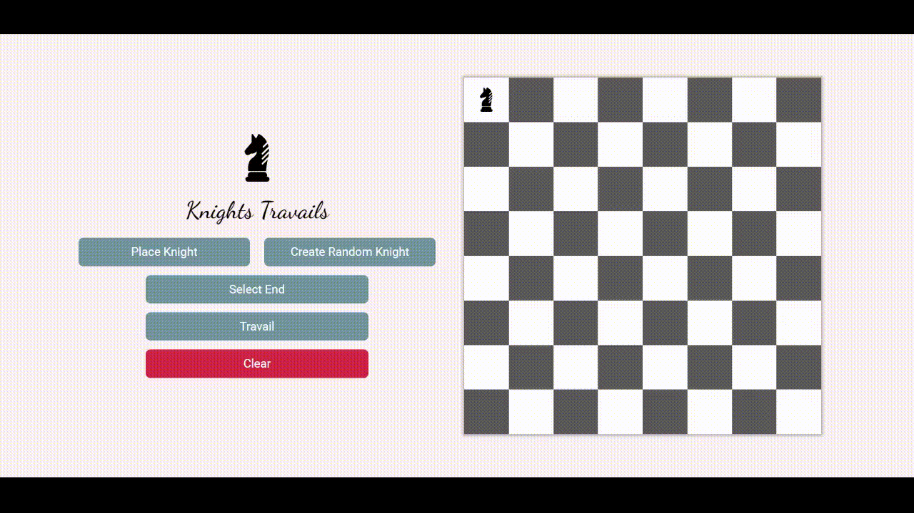

# Knights-Travails

    Simple project that allows users to place a knight and their desired location anywhere on a chessboard.
    The app will then find the optimal path the knight must take for it to reach it's destination in the least
    amount of turns.

    This project helped me grasp concepts regarding graph/tree traversals. As well as learning 
    the fundamentals of binary search trees and shortest path algorithms. This project was built using HTML, SCSS, Javascript, Bootstrap,
    as well as using Webpack and npm to help manage assets. 

    This project is part of 
    <a href='https://www.theodinproject.com/lessons/javascript-knights-travails'>The Odin Project CS course.<a>

↠ <a href='https://moralessa.github.io/Knights-Travails/'>Live Demo<a/> ↞

